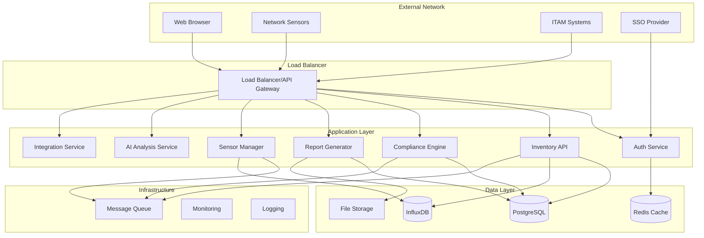
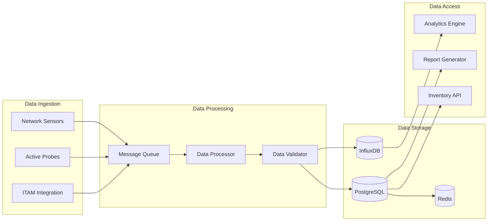

# System Architecture Overview

## Architecture Principles

### Design Philosophy
1. **Microservices Architecture**: Loosely coupled services for scalability and maintainability
2. **Cloud-Native**: Kubernetes-ready with container-first design
3. **Security by Design**: Zero-trust principles and data encryption throughout
4. **Handoff-Ready**: Clean interfaces, comprehensive documentation, standard patterns
5. **Multi-Deployment**: Support for cloud, on-premises, and hybrid deployments

### Quality Attributes
- **Scalability**: Horizontal scaling for enterprise workloads
- **Reliability**: 99.9% uptime with graceful degradation
- **Security**: SOC 2 Type II compliance ready
- **Maintainability**: Clear separation of concerns and standard patterns
- **Performance**: Real-time inventory updates and sub-second query response

## High-Level Architecture



## Core Components

### 1. API Gateway & Load Balancer
**Purpose**: Entry point for all external traffic with routing, authentication, and rate limiting

**Responsibilities**:
- Request routing to appropriate services
- SSL termination and security headers
- Rate limiting and DDoS protection
- Request/response logging and metrics

**Technology**: NGINX or cloud-native load balancer (ALB/GCP Load Balancer)

### 2. Authentication Service
**Purpose**: Centralized authentication and authorization

**Responsibilities**:
- User authentication (local accounts + SSO)
- JWT token generation and validation
- Role-based access control (RBAC)
- Multi-tenant user isolation

**Technology**: Go with JWT libraries, Redis for session storage

### 3. Inventory API Service
**Purpose**: Core crypto inventory management and querying

**Responsibilities**:
- CRUD operations for crypto inventory
- Real-time inventory updates from sensors
- Historical tracking and change detection
- Advanced search and filtering

**Technology**: Go with Gin framework, PostgreSQL for relational data

### 4. Compliance Engine
**Purpose**: Framework-specific analysis and compliance scoring

**Responsibilities**:
- Compliance rule engine (PCI-DSS, NIST, FIPS)
- Gap analysis and risk scoring
- Remediation recommendations
- Framework version management

**Technology**: Go with rule engine library, PostgreSQL for rule storage

### 5. Report Generator
**Purpose**: Automated report generation and export

**Responsibilities**:
- PDF/Excel report generation
- Scheduled report delivery
- Custom report templates
- Dashboard data aggregation

**Technology**: Go with report libraries, file storage for report artifacts

### 6. Sensor Manager
**Purpose**: Network sensor coordination and data processing

**Responsibilities**:
- Sensor registration and health monitoring
- Data ingestion from network sensors
- Data validation and normalization
- Sensor configuration management

**Technology**: Go for high-throughput data processing, InfluxDB for time-series data

### 7. Network Sensor
**Purpose**: Flexible, multi-platform network monitoring agent

**Responsibilities**:
- Passive traffic analysis for crypto discovery
- TLS handshake inspection and certificate chain analysis
- Multi-protocol crypto detection (TLS, SSH, IPSec, VPN)
- Local AI-powered anomaly detection
- Secure data transmission to platform
- Cross-platform deployment (Windows, Linux, containers)

**Technology**: Go for cross-compilation and single-binary deployment

**Deployment Options**:
- **Native Binaries**: Standalone executables for Windows/Linux
- **Container Images**: Docker containers for Kubernetes environments
- **Service Integration**: Windows Service and Linux systemd support
- **Cloud-Native**: Kubernetes DaemonSet deployment

### 8. AI Analysis Service
**Purpose**: Machine learning and intelligent analysis engine

**Responsibilities**:
- Anomaly detection in crypto configurations
- AI-powered risk scoring and trend analysis
- Natural language report generation
- Predictive compliance analysis
- ML model training and inference

**Technology**: Python with TensorFlow/PyTorch, Go for high-performance inference

### 9. Integration Service
**Purpose**: Third-party system integration and data synchronization

**Responsibilities**:
- ITAM system connectors (ServiceNow, Lansweeper, Device42, etc.)
- Real-time data synchronization and webhooks
- API management and authentication
- Data transformation and field mapping
- Integration monitoring and error handling

**Technology**: Go with plugin architecture for extensible connectors

### 10. Web Frontend
**Purpose**: Comprehensive user interface for platform management

**Responsibilities**:
- Executive dashboard with system overview and KPIs
- Crypto inventory visualization with AI insights
- Compliance dashboard and intelligent reporting
- Sensor deployment and fleet management interface
- Integration hub for ITAM system management
- User and tenant administration
- Real-time alerts and notification center
- AI-generated recommendations and insights

**Technology**: React with TypeScript, Ant Design for enterprise UI

## Data Architecture

### Primary Databases

#### PostgreSQL (Relational Data)
- **Users & Tenants**: Multi-tenant user management
- **Crypto Inventory**: Discovered cryptographic implementations
- **Compliance Rules**: Framework-specific compliance requirements
- **Reports**: Report metadata and configurations
- **Sensors**: Sensor registration and configuration

#### InfluxDB (Time-Series Data)
- **Sensor Metrics**: Real-time sensor health and performance
- **Discovery Events**: Time-stamped crypto discovery events
- **Usage Analytics**: Platform usage and performance metrics
- **Audit Logs**: Security and compliance audit trails

#### Redis (Caching & Sessions)
- **Session Storage**: JWT tokens and user sessions
- **Query Cache**: Frequently accessed inventory data
- **Rate Limiting**: API rate limiting counters
- **Real-time Updates**: WebSocket connection management

### Data Flow Architecture



## Security Architecture

### Security Principles
1. **Zero Trust**: Never trust, always verify
2. **Defense in Depth**: Multiple security layers
3. **Least Privilege**: Minimal required permissions
4. **Encryption Everywhere**: Data in transit and at rest
5. **Audit Everything**: Comprehensive security logging

### Security Controls

#### Network Security
- **TLS 1.3**: All communications encrypted
- **mTLS**: Sensor-to-platform authentication
- **Network Segmentation**: Isolated tenant environments
- **VPN/Private Networks**: Secure sensor connectivity

#### Application Security
- **Input Validation**: Comprehensive input sanitization
- **SQL Injection Prevention**: Parameterized queries
- **XSS Protection**: Content Security Policy headers
- **CSRF Protection**: Token-based CSRF prevention

#### Data Protection
- **Encryption at Rest**: Database and file encryption
- **Key Management**: Hardware Security Modules (HSM)
- **Data Classification**: Sensitive data identification
- **Retention Policies**: Automated data lifecycle management

#### Identity & Access
- **Multi-Factor Authentication**: Required for admin access
- **SSO Integration**: SAML 2.0 and OIDC support
- **RBAC**: Granular role-based permissions
- **Session Management**: Secure token handling

## Deployment Architecture

### Cloud Deployment (Kubernetes)
```yaml
# Conceptual Kubernetes Structure
apiVersion: v1
kind: Namespace
metadata:
  name: crypto-inventory-{tenant}
  
# Services deployed per tenant namespace:
# - api-gateway (shared or per-tenant)
# - auth-service
# - inventory-api
# - compliance-engine
# - report-generator
# - sensor-manager
# - postgresql
# - influxdb
# - redis
```

### Multi-Tenancy Strategy
1. **Namespace Isolation**: Kubernetes namespaces per tenant
2. **Database Isolation**: Separate database instances for enterprise customers
3. **Network Policies**: Tenant traffic isolation
4. **Resource Quotas**: CPU/memory limits per tenant

### Monitoring & Observability
- **Metrics**: Prometheus + Grafana
- **Logging**: ELK Stack (Elasticsearch, Logstash, Kibana)
- **Tracing**: Jaeger for distributed tracing
- **Alerting**: PagerDuty integration for critical alerts

## Integration Architecture

### External Integrations
1. **SSO Providers**: SAML 2.0, OIDC (Okta, Azure AD, etc.)
2. **ITAM Systems**: REST APIs for asset inventory sync
3. **SIEM Platforms**: Security event forwarding
4. **Ticketing Systems**: Automated ticket creation for compliance gaps

### API Design
- **RESTful APIs**: Standard HTTP methods and status codes
- **OpenAPI 3.0**: Comprehensive API documentation
- **Versioning**: Semantic versioning with backward compatibility
- **Rate Limiting**: Per-tenant API quotas

---

*This architecture supports scalable, secure, and maintainable development while enabling easy handoff to future development teams.*
