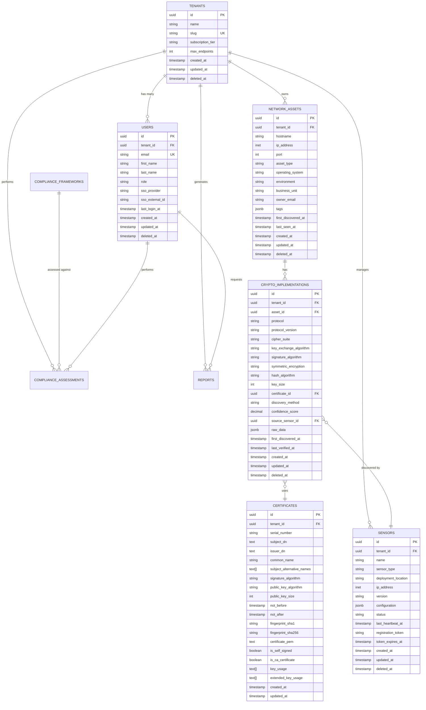

# Data Models and Database Schema

## Overview

This document defines the core data models for the crypto inventory platform. The models are designed to support multi-tenancy, real-time updates, and comprehensive compliance analysis while maintaining data integrity and performance.

## Database Design Principles

1. **Multi-Tenant Isolation**: Tenant ID in all domain entities
2. **Audit Trail**: Created/updated timestamps and user tracking
3. **Soft Deletes**: Logical deletion for compliance and recovery
4. **Normalization**: Balanced approach for performance and maintainability
5. **Extensibility**: JSON columns for evolving requirements

## PostgreSQL Schema (Relational Data)

### Tenant Management

#### Tenants Table
```sql
CREATE TABLE tenants (
    id UUID PRIMARY KEY DEFAULT gen_random_uuid(),
    name VARCHAR(255) NOT NULL,
    slug VARCHAR(100) UNIQUE NOT NULL,
    subscription_tier VARCHAR(50) NOT NULL DEFAULT 'basic',
    max_endpoints INTEGER DEFAULT 100,
    created_at TIMESTAMP WITH TIME ZONE DEFAULT NOW(),
    updated_at TIMESTAMP WITH TIME ZONE DEFAULT NOW(),
    deleted_at TIMESTAMP WITH TIME ZONE,
    
    CONSTRAINT valid_slug CHECK (slug ~ '^[a-z0-9-]+$')
);

CREATE INDEX idx_tenants_slug ON tenants(slug);
CREATE INDEX idx_tenants_deleted_at ON tenants(deleted_at) WHERE deleted_at IS NULL;
```

#### Users Table
```sql
CREATE TABLE users (
    id UUID PRIMARY KEY DEFAULT gen_random_uuid(),
    tenant_id UUID NOT NULL REFERENCES tenants(id),
    email VARCHAR(255) UNIQUE NOT NULL,
    first_name VARCHAR(100),
    last_name VARCHAR(100),
    role VARCHAR(50) NOT NULL DEFAULT 'viewer',
    sso_provider VARCHAR(50),
    sso_external_id VARCHAR(255),
    last_login_at TIMESTAMP WITH TIME ZONE,
    created_at TIMESTAMP WITH TIME ZONE DEFAULT NOW(),
    updated_at TIMESTAMP WITH TIME ZONE DEFAULT NOW(),
    deleted_at TIMESTAMP WITH TIME ZONE,
    
    CONSTRAINT valid_email CHECK (email ~ '^[^@]+@[^@]+\.[^@]+$'),
    CONSTRAINT valid_role CHECK (role IN ('admin', 'analyst', 'viewer'))
);

CREATE INDEX idx_users_tenant_id ON users(tenant_id);
CREATE INDEX idx_users_email ON users(email);
CREATE INDEX idx_users_sso ON users(sso_provider, sso_external_id);
```

### Billing (Provider-Agnostic)

The platform supports multiple billing providers via a normalized schema, with Stripe as the initial adapter.

Key tables:

- `billing_providers` (id, key, display_name, is_active)
- `billing_customers` (tenant_id, provider_id, external_customer_id, email, default_payment_method)
- `billing_subscriptions` (tenant_id, provider_id, external_subscription_id, plan_key, status, current_period_start, current_period_end, cancel_at_period_end)
- `billing_invoices` (tenant_id, provider_id, external_invoice_id, amount_cents, currency, status, issued_at, due_at, paid_at)
- `billing_events` (provider_id, external_event_id, event_type, payload, received_at, processed_at)

Subscription tier mapping:

- `tenants.subscription_tier_id` references `subscription_tiers.id`
- On webhook events, if `plan_key` maps to `subscription_tiers.name`, the tenant's tier is aligned accordingly.

### Network Discovery

#### Network Assets Table
```sql
CREATE TABLE network_assets (
    id UUID PRIMARY KEY DEFAULT gen_random_uuid(),
    tenant_id UUID NOT NULL REFERENCES tenants(id),
    hostname VARCHAR(255),
    ip_address INET,
    port INTEGER,
    asset_type VARCHAR(50) NOT NULL, -- 'server', 'endpoint', 'service'
    operating_system VARCHAR(100),
    environment VARCHAR(50), -- 'production', 'staging', 'development'
    business_unit VARCHAR(100),
    owner_email VARCHAR(255),
    tags JSONB DEFAULT '{}',
    first_discovered_at TIMESTAMP WITH TIME ZONE DEFAULT NOW(),
    last_seen_at TIMESTAMP WITH TIME ZONE DEFAULT NOW(),
    created_at TIMESTAMP WITH TIME ZONE DEFAULT NOW(),
    updated_at TIMESTAMP WITH TIME ZONE DEFAULT NOW(),
    deleted_at TIMESTAMP WITH TIME ZONE,
    
    CONSTRAINT valid_asset_type CHECK (asset_type IN ('server', 'endpoint', 'service', 'appliance')),
    CONSTRAINT valid_port CHECK (port BETWEEN 1 AND 65535)
);

CREATE INDEX idx_network_assets_tenant_id ON network_assets(tenant_id);
CREATE INDEX idx_network_assets_ip_port ON network_assets(ip_address, port);
CREATE INDEX idx_network_assets_hostname ON network_assets(hostname);
CREATE INDEX idx_network_assets_tags ON network_assets USING GIN(tags);
```

#### Crypto Implementations Table
```sql
CREATE TABLE crypto_implementations (
    id UUID PRIMARY KEY DEFAULT gen_random_uuid(),
    tenant_id UUID NOT NULL REFERENCES tenants(id),
    asset_id UUID NOT NULL REFERENCES network_assets(id),
    protocol VARCHAR(50) NOT NULL, -- 'TLS', 'SSH', 'IPSec', etc.
    protocol_version VARCHAR(20),
    cipher_suite VARCHAR(255),
    key_exchange_algorithm VARCHAR(100),
    signature_algorithm VARCHAR(100),
    symmetric_encryption VARCHAR(100),
    hash_algorithm VARCHAR(100),
    key_size INTEGER,
    certificate_id UUID, -- References certificates table
    discovery_method VARCHAR(50) NOT NULL, -- 'passive', 'active', 'manual'
    confidence_score DECIMAL(3,2) DEFAULT 1.0, -- 0.0 to 1.0
    source_sensor_id UUID, -- References sensors table
    raw_data JSONB, -- Original discovery data
    first_discovered_at TIMESTAMP WITH TIME ZONE DEFAULT NOW(),
    last_verified_at TIMESTAMP WITH TIME ZONE DEFAULT NOW(),
    created_at TIMESTAMP WITH TIME ZONE DEFAULT NOW(),
    updated_at TIMESTAMP WITH TIME ZONE DEFAULT NOW(),
    deleted_at TIMESTAMP WITH TIME ZONE,
    
    CONSTRAINT valid_protocol CHECK (protocol IN ('TLS', 'SSH', 'IPSec', 'VPN', 'Database', 'API')),
    CONSTRAINT valid_discovery_method CHECK (discovery_method IN ('passive', 'active', 'manual', 'integration')),
    CONSTRAINT valid_confidence CHECK (confidence_score BETWEEN 0.0 AND 1.0)
);

CREATE INDEX idx_crypto_implementations_tenant_id ON crypto_implementations(tenant_id);
CREATE INDEX idx_crypto_implementations_asset_id ON crypto_implementations(asset_id);
CREATE INDEX idx_crypto_implementations_protocol ON crypto_implementations(protocol);
CREATE INDEX idx_crypto_implementations_cipher_suite ON crypto_implementations(cipher_suite);
CREATE INDEX idx_crypto_implementations_discovery ON crypto_implementations(discovery_method, first_discovered_at);
```

#### Certificates Table
```sql
CREATE TABLE certificates (
    id UUID PRIMARY KEY DEFAULT gen_random_uuid(),
    tenant_id UUID NOT NULL REFERENCES tenants(id),
    serial_number VARCHAR(255),
    subject_dn TEXT NOT NULL,
    issuer_dn TEXT NOT NULL,
    common_name VARCHAR(255),
    subject_alternative_names TEXT[],
    signature_algorithm VARCHAR(100),
    public_key_algorithm VARCHAR(100),
    public_key_size INTEGER,
    not_before TIMESTAMP WITH TIME ZONE,
    not_after TIMESTAMP WITH TIME ZONE,
    fingerprint_sha1 VARCHAR(40),
    fingerprint_sha256 VARCHAR(64),
    certificate_pem TEXT,
    is_self_signed BOOLEAN DEFAULT FALSE,
    is_ca_certificate BOOLEAN DEFAULT FALSE,
    key_usage TEXT[],
    extended_key_usage TEXT[],
    created_at TIMESTAMP WITH TIME ZONE DEFAULT NOW(),
    updated_at TIMESTAMP WITH TIME ZONE DEFAULT NOW(),
    
    CONSTRAINT valid_fingerprint_sha1 CHECK (fingerprint_sha1 ~ '^[a-fA-F0-9]{40}$'),
    CONSTRAINT valid_fingerprint_sha256 CHECK (fingerprint_sha256 ~ '^[a-fA-F0-9]{64}$')
);

CREATE INDEX idx_certificates_tenant_id ON certificates(tenant_id);
CREATE INDEX idx_certificates_fingerprint_sha256 ON certificates(fingerprint_sha256);
CREATE INDEX idx_certificates_common_name ON certificates(common_name);
CREATE INDEX idx_certificates_expiry ON certificates(not_after);
```

### Sensor Management

#### Sensors Table
```sql
CREATE TABLE sensors (
    id UUID PRIMARY KEY DEFAULT gen_random_uuid(),
    tenant_id UUID NOT NULL REFERENCES tenants(id),
    name VARCHAR(255) NOT NULL,
    sensor_type VARCHAR(50) NOT NULL, -- 'network', 'endpoint', 'cloud'
    deployment_location VARCHAR(255),
    ip_address INET,
    version VARCHAR(50),
    configuration JSONB DEFAULT '{}',
    status VARCHAR(20) DEFAULT 'inactive',
    last_heartbeat_at TIMESTAMP WITH TIME ZONE,
    registration_token VARCHAR(255),
    token_expires_at TIMESTAMP WITH TIME ZONE,
    created_at TIMESTAMP WITH TIME ZONE DEFAULT NOW(),
    updated_at TIMESTAMP WITH TIME ZONE DEFAULT NOW(),
    deleted_at TIMESTAMP WITH TIME ZONE,
    
    CONSTRAINT valid_sensor_type CHECK (sensor_type IN ('network', 'endpoint', 'cloud', 'api')),
    CONSTRAINT valid_status CHECK (status IN ('active', 'inactive', 'error', 'maintenance'))
);

CREATE INDEX idx_sensors_tenant_id ON sensors(tenant_id);
CREATE INDEX idx_sensors_status ON sensors(status);
CREATE INDEX idx_sensors_last_heartbeat ON sensors(last_heartbeat_at);
```

### Compliance Framework

#### Compliance Frameworks Table
```sql
CREATE TABLE compliance_frameworks (
    id UUID PRIMARY KEY DEFAULT gen_random_uuid(),
    name VARCHAR(100) NOT NULL,
    version VARCHAR(20) NOT NULL,
    description TEXT,
    organization VARCHAR(255), -- 'PCI DSS', 'NIST', 'ISO', etc.
    effective_date DATE,
    rules JSONB NOT NULL, -- Framework-specific rules
    created_at TIMESTAMP WITH TIME ZONE DEFAULT NOW(),
    updated_at TIMESTAMP WITH TIME ZONE DEFAULT NOW(),
    
    UNIQUE(name, version)
);

CREATE INDEX idx_compliance_frameworks_name ON compliance_frameworks(name);
```

#### Compliance Assessments Table
```sql
CREATE TABLE compliance_assessments (
    id UUID PRIMARY KEY DEFAULT gen_random_uuid(),
    tenant_id UUID NOT NULL REFERENCES tenants(id),
    framework_id UUID NOT NULL REFERENCES compliance_frameworks(id),
    assessment_name VARCHAR(255) NOT NULL,
    scope_filter JSONB, -- Asset filtering criteria
    overall_score DECIMAL(5,2), -- Percentage score
    total_checks INTEGER,
    passed_checks INTEGER,
    failed_checks INTEGER,
    not_applicable_checks INTEGER,
    assessment_results JSONB, -- Detailed results
    assessed_at TIMESTAMP WITH TIME ZONE DEFAULT NOW(),
    assessed_by UUID REFERENCES users(id),
    created_at TIMESTAMP WITH TIME ZONE DEFAULT NOW(),
    updated_at TIMESTAMP WITH TIME ZONE DEFAULT NOW()
);

CREATE INDEX idx_compliance_assessments_tenant_id ON compliance_assessments(tenant_id);
CREATE INDEX idx_compliance_assessments_framework ON compliance_assessments(framework_id);
CREATE INDEX idx_compliance_assessments_date ON compliance_assessments(assessed_at);
```

### Reporting

#### Reports Table
```sql
CREATE TABLE reports (
    id UUID PRIMARY KEY DEFAULT gen_random_uuid(),
    tenant_id UUID NOT NULL REFERENCES tenants(id),
    report_type VARCHAR(50) NOT NULL, -- 'compliance', 'inventory', 'risk'
    title VARCHAR(255) NOT NULL,
    description TEXT,
    template_id UUID, -- References report templates
    parameters JSONB, -- Report generation parameters
    status VARCHAR(20) DEFAULT 'pending',
    file_path VARCHAR(500), -- Storage location
    file_format VARCHAR(10), -- 'PDF', 'Excel', 'CSV'
    file_size_bytes BIGINT,
    generated_at TIMESTAMP WITH TIME ZONE,
    expires_at TIMESTAMP WITH TIME ZONE,
    requested_by UUID REFERENCES users(id),
    created_at TIMESTAMP WITH TIME ZONE DEFAULT NOW(),
    updated_at TIMESTAMP WITH TIME ZONE DEFAULT NOW(),
    
    CONSTRAINT valid_report_type CHECK (report_type IN ('compliance', 'inventory', 'risk', 'certificate')),
    CONSTRAINT valid_status CHECK (status IN ('pending', 'generating', 'completed', 'failed', 'expired')),
    CONSTRAINT valid_format CHECK (file_format IN ('PDF', 'Excel', 'CSV', 'JSON'))
);

CREATE INDEX idx_reports_tenant_id ON reports(tenant_id);
CREATE INDEX idx_reports_status ON reports(status);
CREATE INDEX idx_reports_created_at ON reports(created_at);
```

## InfluxDB Schema (Time-Series Data)

### Sensor Metrics
```influxql
-- Measurement: sensor_metrics
-- Tags: tenant_id, sensor_id, sensor_name, metric_type
-- Fields: value, status_code, error_message
-- Time: timestamp

-- Example data points:
sensor_metrics,tenant_id=uuid,sensor_id=uuid,sensor_name=corp-sensor-01,metric_type=cpu_usage value=45.2 1634567890000000000
sensor_metrics,tenant_id=uuid,sensor_id=uuid,sensor_name=corp-sensor-01,metric_type=memory_usage value=78.5 1634567890000000000
sensor_metrics,tenant_id=uuid,sensor_id=uuid,sensor_name=corp-sensor-01,metric_type=network_packets value=1250 1634567890000000000
```

### Discovery Events
```influxql
-- Measurement: discovery_events
-- Tags: tenant_id, asset_id, discovery_method, protocol, sensor_id
-- Fields: crypto_implementation_id, confidence_score, details
-- Time: discovery_timestamp

-- Example data points:
discovery_events,tenant_id=uuid,asset_id=uuid,discovery_method=passive,protocol=TLS,sensor_id=uuid crypto_implementation_id="uuid",confidence_score=0.95,details="TLS 1.3 connection observed" 1634567890000000000
```

### Platform Metrics
```influxql
-- Measurement: platform_metrics
-- Tags: tenant_id, service_name, metric_type, environment
-- Fields: value, threshold_exceeded, service_health
-- Time: timestamp

-- Example data points:
platform_metrics,tenant_id=uuid,service_name=inventory-api,metric_type=response_time,environment=prod value=125.5,threshold_exceeded=false 1634567890000000000
platform_metrics,tenant_id=uuid,service_name=compliance-engine,metric_type=queue_depth,environment=prod value=45,threshold_exceeded=false 1634567890000000000
```

### Audit Logs
```influxql
-- Measurement: audit_events
-- Tags: tenant_id, user_id, action_type, resource_type, ip_address
-- Fields: resource_id, success, details, user_agent
-- Time: event_timestamp

-- Example data points:
audit_events,tenant_id=uuid,user_id=uuid,action_type=view,resource_type=crypto_implementation,ip_address=192.168.1.100 resource_id="uuid",success=true,details="Viewed TLS implementation details",user_agent="Mozilla/5.0..." 1634567890000000000
```

## Data Relationships

### Entity Relationship Diagram


## Data Access Patterns

### Common Queries

#### Crypto Inventory by Asset
```sql
-- Get all crypto implementations for a specific asset
SELECT 
    ci.*,
    na.hostname,
    na.ip_address,
    c.common_name,
    c.not_after
FROM crypto_implementations ci
JOIN network_assets na ON ci.asset_id = na.id
LEFT JOIN certificates c ON ci.certificate_id = c.id
WHERE ci.tenant_id = $1 
  AND ci.asset_id = $2 
  AND ci.deleted_at IS NULL
ORDER BY ci.protocol, ci.first_discovered_at DESC;
```

#### Expiring Certificates
```sql
-- Find certificates expiring within 30 days
SELECT 
    c.*,
    COUNT(ci.id) as implementation_count
FROM certificates c
LEFT JOIN crypto_implementations ci ON c.id = ci.certificate_id
WHERE c.tenant_id = $1
  AND c.not_after BETWEEN NOW() AND NOW() + INTERVAL '30 days'
GROUP BY c.id
ORDER BY c.not_after ASC;
```

#### Weak Cryptography Detection
```sql
-- Find potentially weak crypto implementations
SELECT 
    ci.*,
    na.hostname,
    na.ip_address
FROM crypto_implementations ci
JOIN network_assets na ON ci.asset_id = na.id
WHERE ci.tenant_id = $1
  AND ci.deleted_at IS NULL
  AND (
    ci.key_size < 2048 
    OR ci.hash_algorithm IN ('MD5', 'SHA1')
    OR ci.symmetric_encryption LIKE '%DES%'
    OR ci.protocol_version IN ('SSLv2', 'SSLv3', 'TLSv1.0')
  )
ORDER BY ci.confidence_score DESC;
```

### Performance Considerations

#### Indexing Strategy
- **Tenant Isolation**: All tenant_id columns indexed for multi-tenancy
- **Time-based Queries**: Indexes on timestamp columns for historical analysis
- **Search Patterns**: Composite indexes on frequently queried combinations
- **JSON Queries**: GIN indexes on JSONB columns for tag and configuration searches

#### Partitioning Strategy
- **Time-based Partitioning**: Audit logs and metrics partitioned by month
- **Tenant Partitioning**: Consider for large enterprise customers
- **Archive Strategy**: Automated archival of old discovery events and metrics

#### Caching Strategy
- **Redis Cache**: Frequently accessed compliance rules and framework data
- **Query Result Cache**: Cache expensive aggregation queries
- **Session Cache**: User authentication and authorization data

---

*These data models provide a robust foundation for crypto inventory management while supporting multi-tenancy, compliance analysis, and real-time monitoring requirements.*
