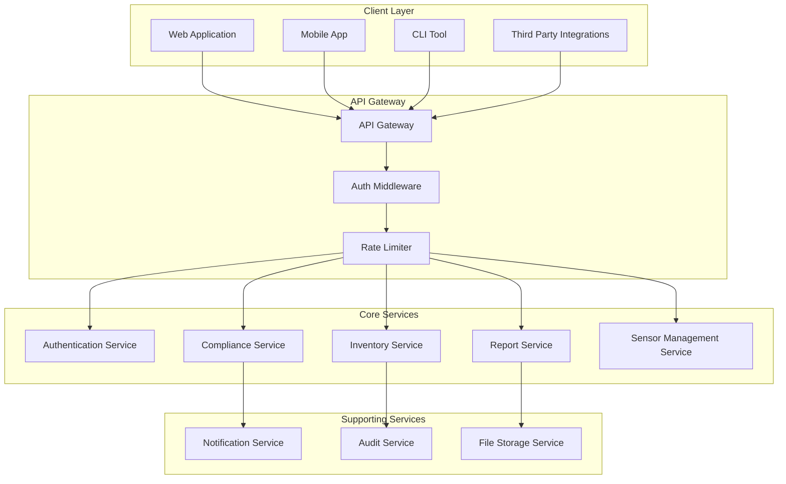

# API Specifications and Service Boundaries

## API Design Principles

1. **RESTful Design**: Standard HTTP methods and status codes
2. **Consistent Naming**: Clear, predictable endpoint patterns
3. **Multi-tenant Security**: Tenant isolation at API level
4. **Versioning Strategy**: URL-based versioning for backward compatibility
5. **Error Handling**: Standardized error responses
6. **Rate Limiting**: Per-tenant API quotas
7. **Documentation**: OpenAPI 3.0 specifications for all endpoints

## Service Architecture

### Service Boundaries



## API Gateway Configuration

### Base URL Structure
```
https://api.cryptoinventory.com/v1/{service}/{resource}
```

### Authentication
- **Bearer Token**: JWT tokens in Authorization header
- **API Keys**: For service-to-service communication
- **SSO Integration**: SAML/OIDC redirects for web authentication

### Rate Limiting
```yaml
rate_limits:
  default: 1000/hour
  enterprise: 10000/hour
  burst: 100/minute
```

## Authentication Service API

### Base Path: `/v1/auth`

#### POST /login
```yaml
summary: Authenticate user with email/password
requestBody:
  required: true
  content:
    application/json:
      schema:
        type: object
        properties:
          email:
            type: string
            format: email
          password:
            type: string
            minLength: 8
        required: [email, password]
responses:
  200:
    description: Successful authentication
    content:
      application/json:
        schema:
          type: object
          properties:
            access_token:
              type: string
            refresh_token:
              type: string
            expires_in:
              type: integer
            user:
              $ref: '#/components/schemas/User'
  401:
    description: Invalid credentials
```

#### POST /sso/initiate
```yaml
summary: Initiate SSO authentication
requestBody:
  required: true
  content:
    application/json:
      schema:
        type: object
        properties:
          provider:
            type: string
            enum: [saml, oidc]
          tenant_slug:
            type: string
        required: [provider, tenant_slug]
responses:
  200:
    description: SSO redirect URL
    content:
      application/json:
        schema:
          type: object
          properties:
            redirect_url:
              type: string
              format: uri
```

#### POST /refresh
```yaml
summary: Refresh access token
requestBody:
  required: true
  content:
    application/json:
      schema:
        type: object
        properties:
          refresh_token:
            type: string
        required: [refresh_token]
responses:
  200:
    description: New access token
    content:
      application/json:
        schema:
          type: object
          properties:
            access_token:
              type: string
            expires_in:
              type: integer
```

#### POST /logout
```yaml
summary: Logout and invalidate tokens
security:
  - BearerAuth: []
responses:
  200:
    description: Successfully logged out
```

## Inventory Service API

### Base Path: `/v1/inventory`

#### GET /assets
```yaml
summary: List network assets
security:
  - BearerAuth: []
parameters:
  - name: page
    in: query
    schema:
      type: integer
      default: 1
  - name: limit
    in: query
    schema:
      type: integer
      default: 50
      maximum: 100
  - name: search
    in: query
    schema:
      type: string
    description: Search by hostname or IP address
  - name: environment
    in: query
    schema:
      type: string
      enum: [production, staging, development]
  - name: asset_type
    in: query
    schema:
      type: string
      enum: [server, endpoint, service, appliance]
responses:
  200:
    description: List of network assets
    content:
      application/json:
        schema:
          type: object
          properties:
            data:
              type: array
              items:
                $ref: '#/components/schemas/NetworkAsset'
            pagination:
              $ref: '#/components/schemas/Pagination'
```

#### POST /assets
```yaml
summary: Create or register new network asset
security:
  - BearerAuth: []
requestBody:
  required: true
  content:
    application/json:
      schema:
        type: object
        properties:
          hostname:
            type: string
          ip_address:
            type: string
            format: ipv4
          port:
            type: integer
            minimum: 1
            maximum: 65535
          asset_type:
            type: string
            enum: [server, endpoint, service, appliance]
          operating_system:
            type: string
          environment:
            type: string
            enum: [production, staging, development]
          business_unit:
            type: string
          owner_email:
            type: string
            format: email
          tags:
            type: object
        required: [asset_type]
responses:
  201:
    description: Asset created successfully
    content:
      application/json:
        schema:
          $ref: '#/components/schemas/NetworkAsset'
  400:
    description: Invalid input data
  409:
    description: Asset already exists
```

#### GET /assets/{asset_id}
```yaml
summary: Get asset details including crypto implementations
security:
  - BearerAuth: []
parameters:
  - name: asset_id
    in: path
    required: true
    schema:
      type: string
      format: uuid
responses:
  200:
    description: Asset details with crypto implementations
    content:
      application/json:
        schema:
          type: object
          properties:
            asset:
              $ref: '#/components/schemas/NetworkAsset'
            crypto_implementations:
              type: array
              items:
                $ref: '#/components/schemas/CryptoImplementation'
  404:
    description: Asset not found
```

#### GET /crypto-implementations
```yaml
summary: List crypto implementations with filtering
security:
  - BearerAuth: []
parameters:
  - name: page
    in: query
    schema:
      type: integer
      default: 1
  - name: limit
    in: query
    schema:
      type: integer
      default: 50
  - name: protocol
    in: query
    schema:
      type: string
      enum: [TLS, SSH, IPSec, VPN, Database, API]
  - name: weak_crypto
    in: query
    schema:
      type: boolean
    description: Filter for potentially weak crypto
  - name: expiring_certs
    in: query
    schema:
      type: integer
    description: Days until certificate expiration
  - name: discovery_method
    in: query
    schema:
      type: string
      enum: [passive, active, manual, integration]
responses:
  200:
    description: List of crypto implementations
    content:
      application/json:
        schema:
          type: object
          properties:
            data:
              type: array
              items:
                $ref: '#/components/schemas/CryptoImplementation'
            pagination:
              $ref: '#/components/schemas/Pagination'
            summary:
              type: object
              properties:
                total_implementations:
                  type: integer
                weak_crypto_count:
                  type: integer
                expiring_certs_count:
                  type: integer
```

#### GET /certificates
```yaml
summary: List certificates with expiration tracking
security:
  - BearerAuth: []
parameters:
  - name: page
    in: query
    schema:
      type: integer
      default: 1
  - name: limit
    in: query
    schema:
      type: integer
      default: 50
  - name: expiring_days
    in: query
    schema:
      type: integer
    description: Show certificates expiring within X days
  - name: self_signed
    in: query
    schema:
      type: boolean
responses:
  200:
    description: List of certificates
    content:
      application/json:
        schema:
          type: object
          properties:
            data:
              type: array
              items:
                $ref: '#/components/schemas/Certificate'
            pagination:
              $ref: '#/components/schemas/Pagination'
```

## Compliance Service API

### Base Path: `/v1/compliance`

#### GET /frameworks
```yaml
summary: List available compliance frameworks
security:
  - BearerAuth: []
responses:
  200:
    description: Available compliance frameworks
    content:
      application/json:
        schema:
          type: array
          items:
            $ref: '#/components/schemas/ComplianceFramework'
```

#### POST /assessments
```yaml
summary: Create new compliance assessment
security:
  - BearerAuth: []
requestBody:
  required: true
  content:
    application/json:
      schema:
        type: object
        properties:
          framework_id:
            type: string
            format: uuid
          assessment_name:
            type: string
          scope_filter:
            type: object
            description: Asset filtering criteria
            properties:
              environments:
                type: array
                items:
                  type: string
              asset_types:
                type: array
                items:
                  type: string
              business_units:
                type: array
                items:
                  type: string
              tags:
                type: object
        required: [framework_id, assessment_name]
responses:
  201:
    description: Assessment created and started
    content:
      application/json:
        schema:
          $ref: '#/components/schemas/ComplianceAssessment'
  400:
    description: Invalid assessment parameters
```

#### GET /assessments
```yaml
summary: List compliance assessments
security:
  - BearerAuth: []
parameters:
  - name: framework_id
    in: query
    schema:
      type: string
      format: uuid
  - name: page
    in: query
    schema:
      type: integer
      default: 1
responses:
  200:
    description: List of assessments
    content:
      application/json:
        schema:
          type: object
          properties:
            data:
              type: array
              items:
                $ref: '#/components/schemas/ComplianceAssessment'
            pagination:
              $ref: '#/components/schemas/Pagination'
```

#### GET /assessments/{assessment_id}
```yaml
summary: Get detailed assessment results
security:
  - BearerAuth: []
parameters:
  - name: assessment_id
    in: path
    required: true
    schema:
      type: string
      format: uuid
responses:
  200:
    description: Detailed assessment results
    content:
      application/json:
        schema:
          type: object
          properties:
            assessment:
              $ref: '#/components/schemas/ComplianceAssessment'
            detailed_results:
              type: array
              items:
                type: object
                properties:
                  rule_id:
                    type: string
                  rule_name:
                    type: string
                  status:
                    type: string
                    enum: [pass, fail, not_applicable]
                  affected_assets:
                    type: array
                    items:
                      $ref: '#/components/schemas/NetworkAsset'
                  remediation_guidance:
                    type: string
```

## Sensor Management Service API

### Base Path: `/v1/sensors`

#### GET /sensors
```yaml
summary: List registered sensors
security:
  - BearerAuth: []
responses:
  200:
    description: List of sensors
    content:
      application/json:
        schema:
          type: array
          items:
            $ref: '#/components/schemas/Sensor'
```

#### POST /sensors/register
```yaml
summary: Register new sensor
security:
  - BearerAuth: []
requestBody:
  required: true
  content:
    application/json:
      schema:
        type: object
        properties:
          name:
            type: string
          sensor_type:
            type: string
            enum: [network, endpoint, cloud, api]
          deployment_location:
            type: string
          configuration:
            type: object
        required: [name, sensor_type]
responses:
  201:
    description: Sensor registered successfully
    content:
      application/json:
        schema:
          type: object
          properties:
            sensor:
              $ref: '#/components/schemas/Sensor'
            registration_token:
              type: string
            download_url:
              type: string
              format: uri
```

#### POST /sensors/{sensor_id}/heartbeat
```yaml
summary: Sensor heartbeat and status update
security:
  - ApiKeyAuth: []
parameters:
  - name: sensor_id
    in: path
    required: true
    schema:
      type: string
      format: uuid
requestBody:
  required: true
  content:
    application/json:
      schema:
        type: object
        properties:
          status:
            type: string
            enum: [active, error, maintenance]
          version:
            type: string
          metrics:
            type: object
            properties:
              cpu_usage:
                type: number
              memory_usage:
                type: number
              network_packets_analyzed:
                type: integer
          error_message:
            type: string
responses:
  200:
    description: Heartbeat received
    content:
      application/json:
        schema:
          type: object
          properties:
            configuration_updated:
              type: boolean
            new_configuration:
              type: object
```

#### POST /sensors/data/ingest
```yaml
summary: Ingest discovery data from sensors
security:
  - ApiKeyAuth: []
requestBody:
  required: true
  content:
    application/json:
      schema:
        type: object
        properties:
          sensor_id:
            type: string
            format: uuid
          timestamp:
            type: string
            format: date-time
          discoveries:
            type: array
            items:
              type: object
              properties:
                asset:
                  type: object
                  properties:
                    hostname:
                      type: string
                    ip_address:
                      type: string
                    port:
                      type: integer
                crypto_implementation:
                  type: object
                  properties:
                    protocol:
                      type: string
                    protocol_version:
                      type: string
                    cipher_suite:
                      type: string
                    certificate_data:
                      type: string
                confidence_score:
                  type: number
                  minimum: 0
                  maximum: 1
                raw_data:
                  type: object
responses:
  202:
    description: Data accepted for processing
```

## Integration Service API

### Base Path: `/v1/integrations`

#### GET /integrations
```yaml
summary: List all configured integrations
security:
  - BearerAuth: []
parameters:
  - name: status
    in: query
    schema:
      type: string
      enum: [active, inactive, error]
  - name: type
    in: query
    schema:
      type: string
      enum: [itam, itsm, security, compliance]
responses:
  200:
    description: List of configured integrations
    content:
      application/json:
        schema:
          type: object
          properties:
            data:
              type: array
              items:
                $ref: '#/components/schemas/Integration'
            summary:
              type: object
              properties:
                total_integrations:
                  type: integer
                active_count:
                  type: integer
                sync_volume_today:
                  type: integer
```

#### POST /integrations
```yaml
summary: Create new integration
security:
  - BearerAuth: []
requestBody:
  required: true
  content:
    application/json:
      schema:
        type: object
        properties:
          name:
            type: string
          type:
            type: string
            enum: [servicenow, lansweeper, device42, manageengine, custom]
          configuration:
            type: object
            properties:
              endpoint_url:
                type: string
                format: uri
              authentication:
                type: object
                properties:
                  type:
                    type: string
                    enum: [api_key, oauth2, basic_auth]
                  credentials:
                    type: object
              field_mapping:
                type: object
              sync_policy:
                type: object
                properties:
                  frequency:
                    type: string
                    enum: [real_time, hourly, daily]
                  direction:
                    type: string
                    enum: [push, pull, bidirectional]
        required: [name, type, configuration]
responses:
  201:
    description: Integration created successfully
    content:
      application/json:
        schema:
          $ref: '#/components/schemas/Integration'
  400:
    description: Invalid configuration
```

#### GET /integrations/{integration_id}/sync-status
```yaml
summary: Get sync status and history
security:
  - BearerAuth: []
parameters:
  - name: integration_id
    in: path
    required: true
    schema:
      type: string
      format: uuid
responses:
  200:
    description: Sync status and history
    content:
      application/json:
        schema:
          type: object
          properties:
            last_sync:
              type: string
              format: date-time
            status:
              type: string
              enum: [success, error, in_progress]
            records_synced:
              type: integer
            errors:
              type: array
              items:
                type: object
                properties:
                  timestamp:
                    type: string
                    format: date-time
                  error_message:
                    type: string
                  record_id:
                    type: string
```

#### POST /integrations/{integration_id}/sync
```yaml
summary: Trigger manual sync
security:
  - BearerAuth: []
parameters:
  - name: integration_id
    in: path
    required: true
    schema:
      type: string
      format: uuid
requestBody:
  required: false
  content:
    application/json:
      schema:
        type: object
        properties:
          sync_type:
            type: string
            enum: [full, incremental]
          filters:
            type: object
responses:
  202:
    description: Sync initiated
    content:
      application/json:
        schema:
          type: object
          properties:
            sync_id:
              type: string
            estimated_duration:
              type: integer
```

#### GET /connectors
```yaml
summary: List available integration connectors
security:
  - BearerAuth: []
responses:
  200:
    description: Available connectors
    content:
      application/json:
        schema:
          type: array
          items:
            type: object
            properties:
              id:
                type: string
              name:
                type: string
              category:
                type: string
                enum: [itam, itsm, security, compliance]
              description:
                type: string
              setup_complexity:
                type: string
                enum: [simple, moderate, complex]
              required_fields:
                type: array
                items:
                  type: string
              documentation_url:
                type: string
                format: uri
```

## Report Service API

### Base Path: `/v1/reports`

#### GET /reports
```yaml
summary: List generated reports
security:
  - BearerAuth: []
parameters:
  - name: report_type
    in: query
    schema:
      type: string
      enum: [compliance, inventory, risk, certificate]
  - name: status
    in: query
    schema:
      type: string
      enum: [pending, generating, completed, failed, expired]
responses:
  200:
    description: List of reports
    content:
      application/json:
        schema:
          type: array
          items:
            $ref: '#/components/schemas/Report'
```

#### POST /reports/generate
```yaml
summary: Generate new report
security:
  - BearerAuth: []
requestBody:
  required: true
  content:
    application/json:
      schema:
        type: object
        properties:
          report_type:
            type: string
            enum: [compliance, inventory, risk, certificate]
          title:
            type: string
          description:
            type: string
          file_format:
            type: string
            enum: [PDF, Excel, CSV]
          parameters:
            type: object
            description: Report-specific parameters
        required: [report_type, title, file_format]
responses:
  202:
    description: Report generation started
    content:
      application/json:
        schema:
          $ref: '#/components/schemas/Report'
```

#### GET /reports/{report_id}/download
```yaml
summary: Download generated report
security:
  - BearerAuth: []
parameters:
  - name: report_id
    in: path
    required: true
    schema:
      type: string
      format: uuid
responses:
  200:
    description: Report file download
    content:
      application/octet-stream:
        schema:
          type: string
          format: binary
  404:
    description: Report not found or not ready
```

## Data Schemas

### Core Schemas

#### NetworkAsset
```yaml
type: object
properties:
  id:
    type: string
    format: uuid
  hostname:
    type: string
  ip_address:
    type: string
  port:
    type: integer
  asset_type:
    type: string
    enum: [server, endpoint, service, appliance]
  operating_system:
    type: string
  environment:
    type: string
  business_unit:
    type: string
  owner_email:
    type: string
  tags:
    type: object
  first_discovered_at:
    type: string
    format: date-time
  last_seen_at:
    type: string
    format: date-time
  created_at:
    type: string
    format: date-time
  updated_at:
    type: string
    format: date-time
```

#### CryptoImplementation
```yaml
type: object
properties:
  id:
    type: string
    format: uuid
  asset_id:
    type: string
    format: uuid
  protocol:
    type: string
  protocol_version:
    type: string
  cipher_suite:
    type: string
  key_exchange_algorithm:
    type: string
  signature_algorithm:
    type: string
  symmetric_encryption:
    type: string
  hash_algorithm:
    type: string
  key_size:
    type: integer
  certificate:
    $ref: '#/components/schemas/Certificate'
  discovery_method:
    type: string
  confidence_score:
    type: number
  first_discovered_at:
    type: string
    format: date-time
  last_verified_at:
    type: string
    format: date-time
```

#### Certificate
```yaml
type: object
properties:
  id:
    type: string
    format: uuid
  serial_number:
    type: string
  subject_dn:
    type: string
  issuer_dn:
    type: string
  common_name:
    type: string
  subject_alternative_names:
    type: array
    items:
      type: string
  signature_algorithm:
    type: string
  public_key_algorithm:
    type: string
  public_key_size:
    type: integer
  not_before:
    type: string
    format: date-time
  not_after:
    type: string
    format: date-time
  fingerprint_sha256:
    type: string
  is_self_signed:
    type: boolean
  is_ca_certificate:
    type: boolean
```

#### Integration
```yaml
type: object
properties:
  id:
    type: string
    format: uuid
  name:
    type: string
  type:
    type: string
    enum: [servicenow, lansweeper, device42, manageengine, custom]
  category:
    type: string
    enum: [itam, itsm, security, compliance]
  status:
    type: string
    enum: [active, inactive, error, configuring]
  configuration:
    type: object
    properties:
      endpoint_url:
        type: string
        format: uri
      authentication_type:
        type: string
        enum: [api_key, oauth2, basic_auth]
      field_mapping:
        type: object
      sync_policy:
        type: object
        properties:
          frequency:
            type: string
            enum: [real_time, hourly, daily]
          direction:
            type: string
            enum: [push, pull, bidirectional]
          filters:
            type: object
  last_sync:
    type: string
    format: date-time
  sync_stats:
    type: object
    properties:
      total_records:
        type: integer
      success_count:
        type: integer
      error_count:
        type: integer
  created_at:
    type: string
    format: date-time
  updated_at:
    type: string
    format: date-time
```

## Error Handling

### Standard Error Response
```yaml
type: object
properties:
  error:
    type: object
    properties:
      code:
        type: string
      message:
        type: string
      details:
        type: object
      request_id:
        type: string
        format: uuid
```

### Common Error Codes
- `INVALID_INPUT`: Request validation failed
- `UNAUTHORIZED`: Authentication required
- `FORBIDDEN`: Insufficient permissions
- `NOT_FOUND`: Resource not found
- `TENANT_LIMIT_EXCEEDED`: Tenant quota exceeded
- `RATE_LIMIT_EXCEEDED`: Too many requests
- `INTERNAL_ERROR`: Server error

## API Documentation

### OpenAPI Generation
- Automated OpenAPI 3.0 spec generation from code annotations
- Interactive documentation with Swagger UI
- API testing interface for developers
- Client SDK generation for multiple languages

### Versioning Strategy
- URL-based versioning (`/v1/`, `/v2/`)
- Backward compatibility for minor versions
- Deprecation notices with migration guides
- Version sunset timeline communication

---

*These API specifications provide a comprehensive interface for all platform functionality while maintaining security, consistency, and ease of integration.*
